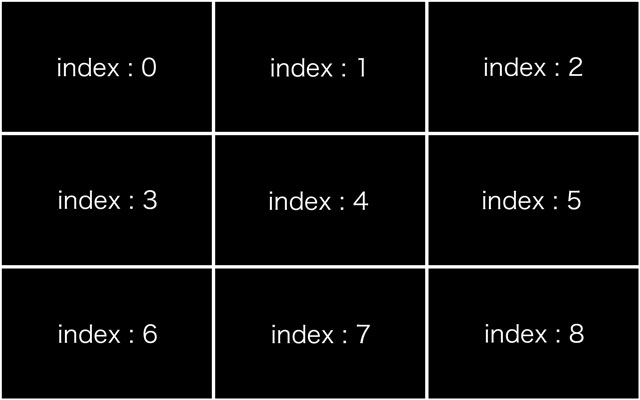
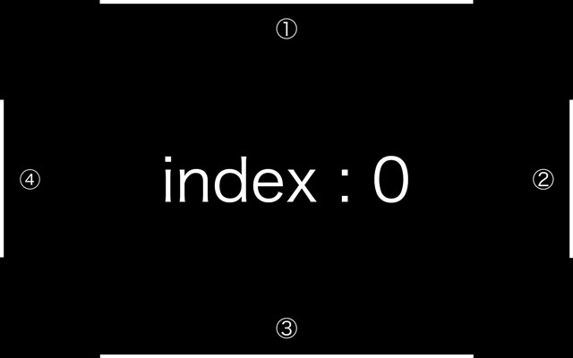

# `<rikaaa-image-tile>`
The Custom element to impliment tile layout and lazy load.


## Installation
```bash
#script

<!-- If you want to use The Custom Element with browser that does not support webcomponents. -->
<script src="https://unpkg.com/@webcomponents/webcomponentsjs@2.2.10/webcomponents-loader.js"></script>

<script src="rikaaa-image-tile.js"></script>
```

## Usage 
```bash
#HTML

<rikaaa-image-tile
    imagesize="640x400"
    imagelength="16"
    src="images/sample1.jpg,
    images/sample2.jpg,
    images/sample3.jpg,
    images/sample4.jpg,
    images/sample5.jpg,
    images/sample6.jpg,
    images/sample7.jpg,
    images/sample8.jpg,
    images/sample9.jpg,
    images/sample10.jpg,
    images/sample11.jpg,
    images/sample12.jpg,
    images/sample13.jpg,
    images/sample14.jpg,
    images/sample15.jpg,
    images/sample16.jpg"
></rikaaa-image-tile>
```

The code blow shown is not essential.
The height of custom element is dynamic.
If you care about this dynamics, it is recommended that add following codes.
```bash
#JavaScript

// scroll to top of tile when click.
var currentScrollY = 0;
var marginTop = 16;

var tile_demo = document.getElementsByTagName("rikaaa-image-tile")[0];

tile_demo.addEventListener("tileClick", function (event) {
    if (event.detail.zoomin) currentScrollY = window.pageYOffset;
});

tile_demo.addEventListener("zoom", function (event) {

    if (event.detail.zoomin === false) return false;

    var desireScrollTop = tile_demo.offsetTop - marginTop;
    var diffFromDisire = desireScrollTop - currentScrollY;
    var newScrollY = currentScrollY + diffFromDisire * event.detail.zoomRatio;

    window.scrollTo(0, newScrollY);

});
```

## UI

### figure1 : when zoom out.


It can be close-uped by click the image.  
The images shown are indecated as same width and height.  
The parameter utilzing in this custom element as the "index" is categorized as above figure.  


### figure2 : when zoom in.


It is possible to transfar the image by drag, when close-uped.  
Following four user interface will be indecated, when close-uped.  

1. EdgeGide of top
1. EdgeGide of rigth
1. EdgeGide of bottom
1. EdgeGide of left

Each EdgeGide will be indecated how mach achieved to the limit of drag availavlity.

## Attributes
|Attribute|Require|Description|
----|----|----
|src = "string"|Require|The parameter to set image path for load the webcomponent by the text string. Need to same image size. Able to set image path more than one. Set of image path by ",". Example: "src="image/sample00.jpg,image/sample01.jpg""|
|imagesize = "string"|Require|The parameter to set image size by text string. For Example, in case of 640px width x 400px height image size to be utilize, set of as "imagesize="640x400""|
|imagelength = "integer"|Require|The parameter to set image length by integral number.|
|row = "integer"||The parameter to set number of column by integral number. The default value is 4. The minimum value is 1. The number of row will be calculated automatically.|
|duration = "integer"||The parameter to set duration of entire animation by integral number. The unit is millisecond. The default value is 500.|
|zoomable = "boolean"	||The parameter to deside acceptance of close-up by truth value. The default value is true.|
|dragable = "boolean"||The parameter to deside acceptance of transfer viewing point by truth value. The default value is true.|
|hoverable = "boolean"||The parameter to deside following actions by truth value. Action1 : Alter the opacity of the image below cursor. Action2 : Alter the cursor icon, in case cursor is on the image. The default value is true.|
|iszoomedstart = "boolean"	||The parameter to deside initialization by truth value duaring close-uped situation. The default value is false. Direction of close-up to the image should be desided by the "firstselect" parameter when this parameter truth.|
|firstselect = "integer"||The parameter to deside direction of close-up to image when this webcomponent initialized. The default value is zero. The minimum value is zero. The maximum value is the number of image minus one. The parameter is utilized mainly in case "iszoomedstard" is true.|
|loadtiming = "string"||The parameter to set timing of image loading by text string. This parameter is equivalent with "rootMargin" parameter of Intersection Observer API. The default value is "100px 0px 100px 0px". The unit is pixel or percentage.|
|backgroundcolor = "color"	||The parameter to set background-color. The value able to set this parameter is corresponding the format indecated by CSS. The default value is "rgba(255,255,255,1)".|
|opacityofselected = "float"||The parameter to set opacity of image by floating decimal point. The opacity indecated by this parameter will be applicable to image bellow cursor. The default value is 0.7.|
|endgideable = "boolean"	||The parameter to deside visiblity of EdgeGide. The default value is ture.|
|endgidewidth = "integer"||The parameter to set width of EdgeGide. The unit is pixel. The default value is three.|
|endgidebarcolor = "color"||The parameter to set color of EdgeGide. The value able to set this parameter is corresponding the format indecated by CSS. The default value is "white".|

## Methods
- __rikaaaimagetile.setRoot(Element)__  

_Set a Element Node as View-port.This Element is equivalent with "root" parameter of Intersection Observer API._
```bash
var load_Ev = document.getElementsByTagName("rikaaa-image-tile")[0];

load_Ev.addEventListener("load", () => {

    tile_domload.setRoot(document.querySelector(".maindemo"));

});
```

## Events
- __addEventListener("load",callback)__  

_This event will be triggered when the custom element loaded._
```bash
var load_Ev = document.getElementsByTagName("rikaaa-image-tile")[0];

tile_loadEv.addEventListener("load", function () {
    console.log("load");
});
```
- __addEventListener("tileLoad",callback)__ 

_This event will be triggered when the image loaded._
```bash
var tile_loadEv = document.getElementsByTagName("rikaaa-image-tile")[0];

tile_loadEv.addEventListener("tileLoad", function () {
    console.log("tile loaded");
});
```
- __addEventListener("zoom",callback)__  

_The event will be triggered duaring close-upping animation._
```bash
var tile_zoomEv = document.getElementsByTagName("rikaaa-image-tile")[0];

tile_zoomEv.addEventListener("zoom", function (event) {
    let zoomIs = (event.detail.zoomin) ? "in" : "out";
    console.log("zoom " + zoomIs);
    console.log("zoom ratio : " + event.detail.zoomRatio);
});
```
- __addEventListener("offsetChange",callback)__  

_The event will be triggered duaring transfering view point._
```bash
var tile_offsetChangeEv = document.getElementsByTagName("rikaaa-image-tile")[0];

tile_offsetChangeEv.addEventListener("offsetChange", function (event) {
    console.log("offsetX from center by pixel : " + event.detail.offsetXFromCenter);
    console.log("offsetY from center by pixel : " + event.detail.offsetYFromCenter);
    console.log("offsetX ratio from left : " + event.detail.offsetXRatioFromLeft);
    console.log("offsetY ratio from top : " + event.detail.offsetYRatioFromTop);
});
```
- __addEventListener("selectedChange",callback)__  

_The event will be triggered when close-pu direction was chenged._
```bash
var tile_selectedChangeEv = document.getElementsByTagName("rikaaa-image-tile")[0];

tile_selectedChangeEv.addEventListener("selectedChange", function (event) {
    console.log("current selected index of tile : " + event.detail.currentIndex); 
});
```
- __addEventListener("tileClick",callback)__  

_The event will be triggered when image was clicked._
```bash
var tile_tileClickEv = document.getElementsByTagName("rikaaa-image-tile")[0];

tile_tileClickEv.addEventListener("tileClick", function (evnet) {
    let zoomIs = (event.detail.zoomin) ? "in" : "ou";
    console.log("this click is "zoom " + zoomIs + """);
    console.log("current selected index of tile : " + event.detail.currentIndex);
});
```
## Browser Support
- Google Chrome  
- Safari  
- Firefox  
- Edge  
- IE 11+ (When using polyfill)

## License
MIT © [rikaaa.org](http://rikaaa.org/)
